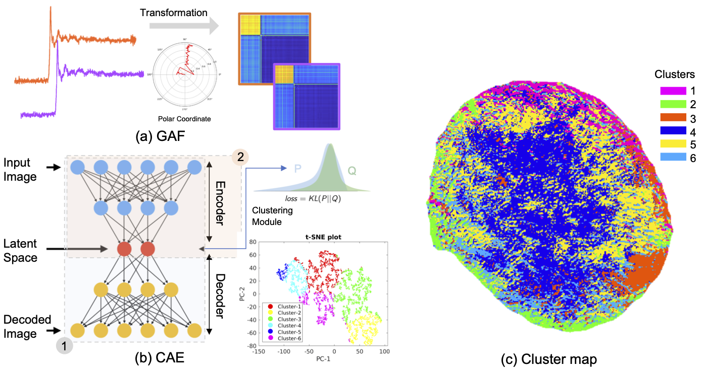

# EXAFSClustering
Clustering for EXAFS data from transmission X-ray microscopy (TXM)


- The post edge region (extended X-ray absorption fine structure, EXAFS), which can offer valuable information on the structure ordering/disordering and atomic bonding, is often not the focus in TXM spectro-microscopy studies. This is largely due to the limitation in the signal-to-noise ratio of the local spectra for EXAFS data reduction and fitting.
- Combining a machine-learning-based data classification method, we effectively reduce the dimensionality and complexity of the EXAFS data for detailed quantitative fitting. 



(a) shows the Gramian Angular Field (GAF) approach for encoding an EXAFS spectrum in to an image. Panel (b) illustrates an autoencoder compression framework, which consists of two major components: the encoder and the decoder. A clustering module is attached to the latent space (upper right of panel (b)). The clustering results are plotted in the two dimensional space defined by the first and the second principle components to evaluate the separation of the data points in the six clusters (lower right of panel (b)).

## Citation

Use this bibtex to cite this repository:
```
@article{qian_acsel2021,
  title={Understanding the mesoscale degradation in nickel-rich cathode materials through machine-learning-revealed strain-redox decoupling},
  author={G. Qian, J. Zhang et al.},
  journal={ACS Energy Letters},
  year={2021}
}
```
